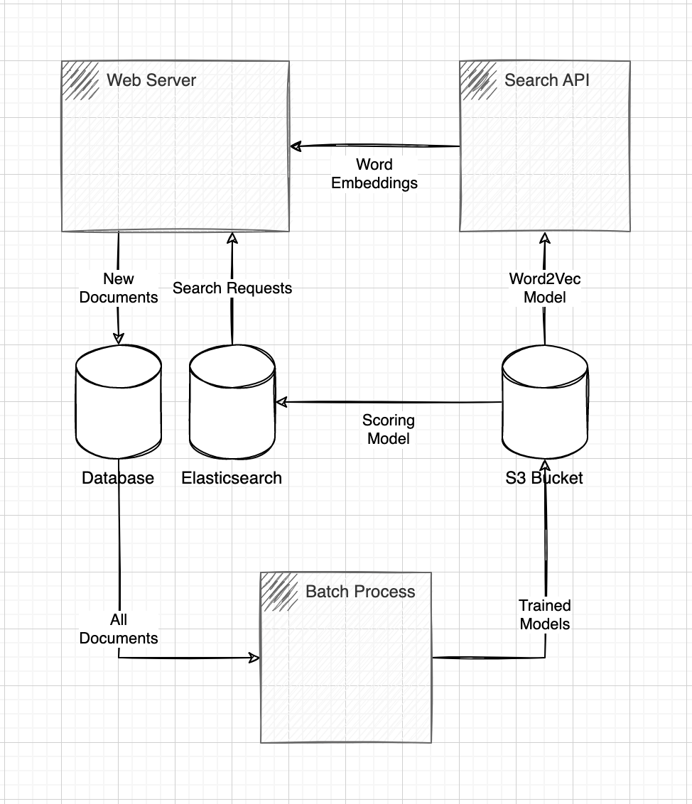

# search-keras-gensim-elasticsearch
Search Engine using Word Embeddings, GloVe, Neural Networks, BERT, and Elasticsearch


# 1 References

- [Gensim Word2vec embeddings](https://radimrehurek.com/gensim/models/word2vec.html)
- [GloVe: Global Vectors for Word Representation](https://github.com/stanfordnlp/GloVe)
- [HuggingFace Documentation](https://huggingface.co/docs/transformers/installation)
- [PyTorch](https://pytorch.org/get-started/locally/)
- [Elasticsearch Learning to Rank: the documentation](https://elasticsearch-learning-to-rank.readthedocs.io/en/latest/)
- [Elasticsearch LTR versions](http://es-learn-to-rank.labs.o19s.com/)

# 2 Architecture Overview



#### 2.1 Application

|File|Description|
|---|---|
|[app/embedding.py](./app/embedding.py)|Vectorization utilities.|
|[app/summary.py](./app/summary.py)|Summarization utilities.|
|[app/score.py](./app/score.py)|Scoring model.|
|[app/search.py](./app/search.py)|Elasticsearch search util.|

#### 2.2 Datasets

|File|Description|
|---|---|
|[data/songs.csv](./data/songs.csv)|Supervised scoring sample.|
|[data/docs.txt](./data/docs.txt)|New documents to train the embedding function.|
|[data/search.csv](./data/search.csv)|Documents to be loaded into Elasticsearch.|

#### 2.3 Infrastructure

|File|Description|
|---|---|
|[config/elasticsearch.yml](./config/elasticsearch.yml)|Elasticsearch configuration.|
|[Dockerfile](./Dockerfile)|Elasticsearch Docker file.|

# 3 Instructions

#### 3.1 Installing a Python virtual environment.
```bash
virtualenv .env
source .env/bin/activate
pip install -r requirements.txt
```

#### 3.2 Installing nltk.
```python
import nltk
nltk.download('punkt')
nltk.download('averaged_perceptron_tagger')
nltk.download('maxent_ne_chunker')
nltk.download('words')
nltk.download('wordnet')
```

#### 3.3 Compiling TensorFlow for PyTorch
```bash
git clone https://github.com/tensorflow/tensorflow.git
cd tensorflow
brew install bazel || sudo yum install bazel || sudo apt-get install bazel
model = BartForConditionalGeneration.from_pretrained('facebook/bart-large-cnn')
python configure.py
```

#### 3.4 Downloading GloVe.
```bash
wget https://huggingface.co/stanfordnlp/glove/resolve/main/glove.6B.zip
unzip glove.6B.zip 
```

#### 3.5 Sampling new documents embeddings
```python
All you touch and all you see is all your life will ever be.
We're just two lost souls swimming in a fishbowl, year after year.
Tear down the wall.
The lunatic is on the grass.
Is there anybody out there?
We don't need no education.
Shine on you crazy diamond.
[...]
```

#### 3.6 Training the GloVe Word2Vec model with more documents.
```python
from app.embedding import Embedding
embedding: Embedding = Embedding()
embedding.load(path="glove.6B.300d.txt")
embedding.train("data/docs.txt")
embedding.get_embeddings('The grass was greener')
embedding.save(path='embedding.h5')
```

#### 3.7 Sampling a dataset of documents and queries.
```csv
doc,query,relevance
"Hanging on in quiet desperation is the English way",hanging,1
"Hanging on in quiet desperation is the English way",spanish,0
"All that is now, all that is gone",go,1
"All that is now, all that is gone",cry,0
"All that is now, all that is gone",wall,0
"Waiting for someone or something to show you the way",waiting,1
"Waiting for someone or something to show you the way",wait,1
"Waiting for someone or something to show you the way",run,0
"Can't keep my eyes from the circling skies","red ribbon",1
"Can't keep my eyes from the circling skies","keep eyes",1
"Can't keep my eyes from the circling skies","eyes",1
"Can't keep my eyes from the circling skies","mouth",0
[...]
```

#### 3.8 Training a relevance model to predict the scores of tuples of documents and queries.
```python3
from app.embedding import Embedding
from app.score import Score
embedding: Embedding = Embedding()
embedding.load(path="glove.6B.300d.txt")
model: Score = Score()
model.train('data/songs.csv', embedding=embedding)
print(model.predict(query='green', doc='The grass was greener', embedding=embedding))
model.save('relevance.h5')
```

#### 3.9 Testing the summarization module
```python3
from app.summary import Summary
summary: Summary = Summary()
summary.load('facebook/bart-base')
print(summary.get_summary("Scientists have discovered a new species of dinosaur in the Amazon rainforest."))
```

#### 3.10 Building & running an Elasticsearch cluster.
```bash
docker build -t "my_es_image" .
docker run -p 127.0.0.1:9300:9200 -t "my_es_image"
curl -X GET "http://localhost:9300/"  
```

#### 3.11 Sampling documents to be loaded into Elasticsearch
```python3
id,title,text
1,Grass,The grass was greener
2,Light,The light was brifther
3,Sweet,The taste was sweeter
4,Friends,When friends surround
[...]
```

#### 3.12 Indexing some documents.
```python3
from app.embedding import Embedding
from app.search import Search
from app.summary import Summary
summary: Summary = Summary()
summary.load('facebook/bart-base')
embedding: Embedding = Embedding()
embedding.load(path="glove.6B.300d.txt")
search: Search = Search(index='my_es_index2', protocol='http', host='localhost', port=9300)
search.init()
search.load('data/search.csv', embedding=embedding, summary=summary)
```

#### 3.13 Combining all the predictions models to get relevant results.
```python3
from app.embedding import Embedding
from app.search import Search
from app.score import Score
embedding: Embedding = Embedding()
embedding.load(path="glove.6B.300d.txt")
search: Search = Search(index='my_es_index2', protocol='http', host='localhost', port=9300)
search.load('data/search.csv', embedding=embedding, summary=summary)
score: Score = Score()
score.load('relevance.h5')
print(search.search(query='green', embedding=embedding, score=score, size=5))
```
